# Hướng dẫn sử dụng GitHub cơ bản

## I. Giới thiệu chung về GitHub

### 1. GitHub là gì?

GitHub là một dịch vụ lưu trữ mã nguồn (source code) trực tuyến dựa trên nền tảng Git. Nó cung cấp một nền tảng cho các nhà phát triển để phát triển, quản lý và theo dõi mã nguồn của dự án phần mềm. Dịch vụ này cho phép các nhóm phát triển làm việc cùng nhau trên các dự án từ xa và theo dõi lịch sử của mã nguồn.

### 2. Một vài khái niệm của Git bạn cần nắm

- **Repository**: Kho quản lý dữ liệu, là nơi lưu trữ các dữ liệu, mã nguồn của project.
- **Git**: Là tiền tố của các lệnh được sử dụng trên giao diện dòng lệnh (CLI).
- **Branch (nhánh)**: Là cơ chế giúp quản lý các phiên bản khác nhau của mã nguồn trong cùng một kho lưu trữ (repository). Mỗi branch đại diện cho một dòng phát triển riêng biệt của dự án, cho phép bạn làm việc trên các tính năng, sửa lỗi hoặc thử nghiệm ý tưởng mới mà không ảnh hưởng đến mã nguồn chính (thường được lưu trữ trên branch `main` hoặc `master`).
- **Clone**: Là lệnh được sử dụng để tạo ra một bản sao của một kho lưu trữ từ một máy chủ về máy tính cục bộ.
- **Commit**: Lưu lại các thay đổi trong mã nguồn vào kho lưu trữ. Mỗi commit giống như một điểm chụp lại trạng thái hiện tại của mã nguồn tại một thời điểm cụ thể.
- **Push**: Là thao tác để đẩy các thay đổi từ repository cục bộ lên repository trên máy chủ.
- **Pull**: Lệnh này giúp bạn lấy về (fetch) và hợp nhất (merge) các thay đổi mới nhất từ một nhánh trên remote.
- **.gitignore**: File được sử dụng để loại bỏ các thư mục, file mà mình không muốn push lên máy chủ Git.

### 3. Cài đặt Git

Hai điều đầu tiên bạn cần làm là cài đặt git và tạo một tài khoản GitHub miễn phí.
Để cài Git hãy làm theo hướng dẫn [tại đây](https://git-scm.com/book/en/v2/Getting-Started-Installing-Git) (nếu chưa cài đặt). Lưu ý rằng đối với hướng dẫn này, chúng ta sẽ chỉ sử dụng git trên dòng lệnh. Mặc dù có một số GUI git (giao diện người dùng đồ họa) tuyệt vời, tôi nghĩ rằng sẽ dễ dàng hơn khi học git bằng các lệnh dành riêng cho git trước rồi sau đó thử GUI git khi bạn đã quen với lệnh hơn.

## II. Hướng dẫn sử dụng GitHub

### 1. Tạo tài khoản

- **Bước 1**: Truy cập [GitHub](https://github.com/) và chọn **Sign up**.
- **Bước 2**: Nhập thông tin tài khoản email và mật khẩu, sau đó chọn **Continue**.
- **Bước 3**: Xác minh tài khoản để chứng minh là người thật.
  - Có 2 phương thức xác thực:
    - **Xác minh bằng hình ảnh**
    - **Xác thực bằng âm thanh**
- **Bước 4**: Sau khi hoàn tất xác minh người thật, bạn sẽ cần xác minh email. GitHub sẽ gửi một dãy số vào email của bạn, chỉ cần nhập vào để hoàn thành bước này.

### 2. Tạo SSH Key cho tài khoản

#### Tại sao nên dùng SSH key thay vì HTTPS khi khởi tạo repo và commit?

- Từ tháng 8/2021, GitHub không còn hỗ trợ xác thực bằng mật khẩu thông qua HTTPS mà yêu cầu sử dụng **Personal Access Token (PAT)**. Token này phải được tạo từ GitHub và thay thế mật khẩu. Nếu bạn chưa tạo và sử dụng token, thì push qua HTTPS sẽ không thành công.

#### SSH key là gì?

- SSH key là một cặp khóa mã hóa gồm một khóa công khai và một khóa bí mật. Chúng được sử dụng để xác thực bảo mật khi bạn kết nối với GitHub từ máy tính của mình mà không cần nhập mật khẩu mỗi lần truy cập.

#### Các bước cài đặt SSH key để liên kết tài khoản GitHub với máy tính

**Bước 1**: **Kiểm tra máy đã có SSH key chưa**

- Ở màn hình desktop, chuột phải chọn **Git Bash Here** chạy lệnh:
  ```bash
  ls -al ~/.ssh
  ```
  Nếu thấy các file như `id_rsa` và `id_rsa.pub`, tức là bạn đã có SSH key. Nếu không cần tạo SSH key mới.

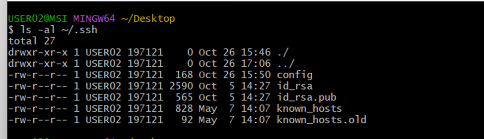

- Chạy lệnh sau để xem dãy key và coppy chúng:

```bash
cat ~/.ssh/id_rsa.pub
```

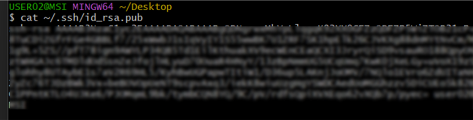
**Trường hợp trên máy chưa có key**

- chạy lệnh `ssh-keygen` nhấn enter
  coppy đường dẫn mở trên cửa sổ trình duyệt và coppy nội dung
  Vd: C:\Users\USER02/.ssh/id_rsa.pub

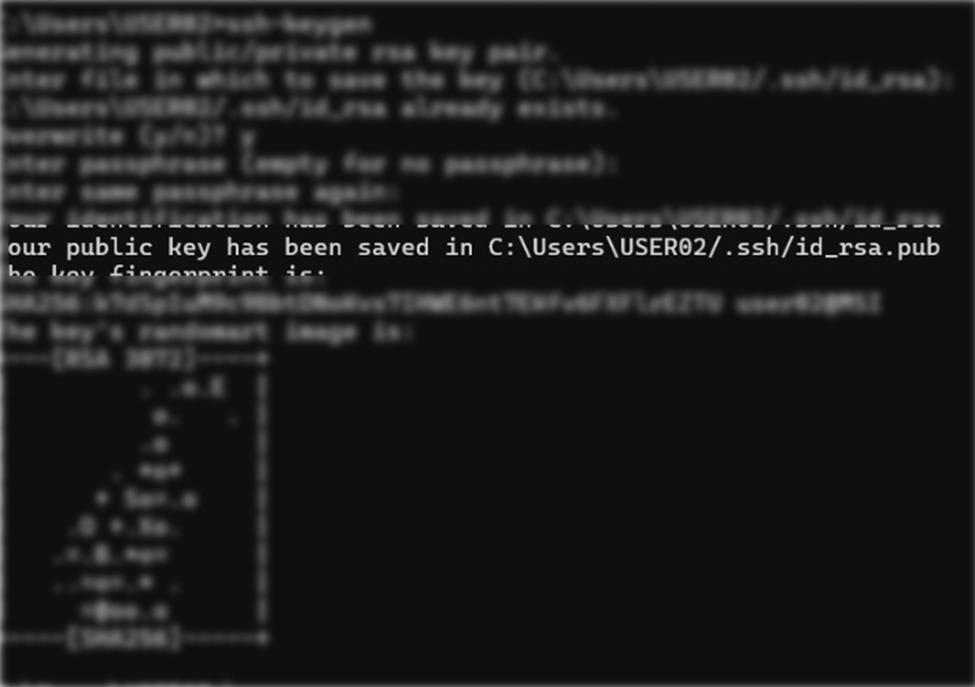

**Bước 2**: vào github chọn **setting** chọn **SSH and GPG key** chọn **New SSH key** nhập key đã coppy vào mục key và Nhấn **Add SSH key**

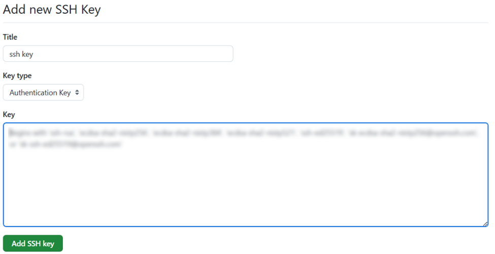

### 4. Tạo Repository trên GitHub

**Bước 1**: Đăng nhập tài khoản [Github](https://github.com/login).

**Bước 2**: Sau khi đã đăng nhập, nhấn vào nút " **+** " ở góc trên cùng bên phải của màn hình và chọn **New repository** hoặc nhấn **Create repository** bên góc phải.

<!--  -->

**Bước 3**: Điền các thông tin và nhấn **Create repository** để khởi tạo

- **Repository name**: Đặt tên cho repository mà bạn muốn tạo.
- **Description**: Mô tả ngắn gọn về repository (không bắt buộc).
- **Public/Private**: Chế độ **Public** hoặc **Private** cho repository.
- **Add a README file**: Khi chọn “Add a README file”, GitHub sẽ tự động tạo tệp `README.md` trong repository và hiển thị ngay trên trang chính.
  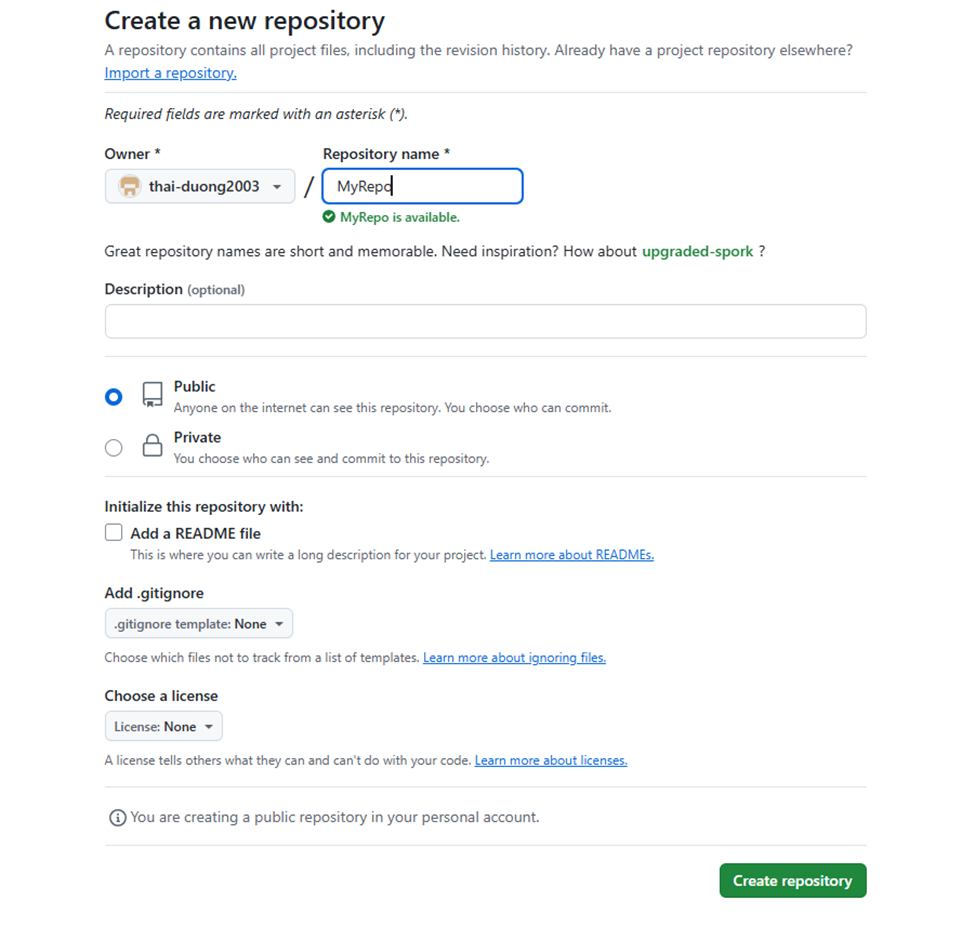 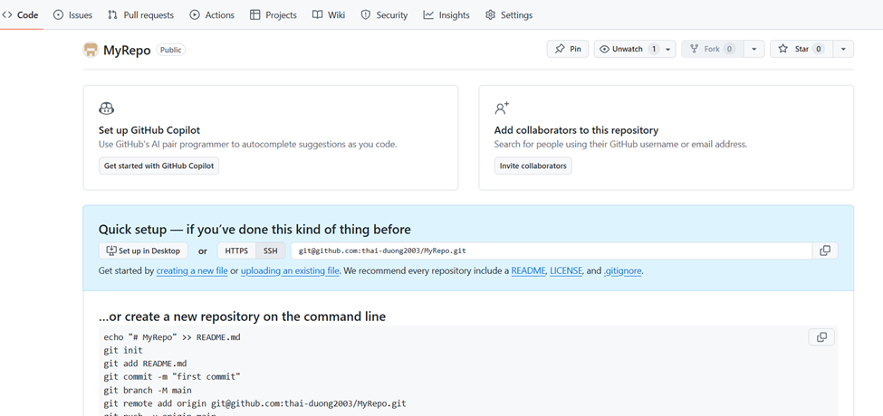

  **Bước 4**: Di chuyển vào thư mục dự án chuột phải và chọn **Git Bash Here**.
  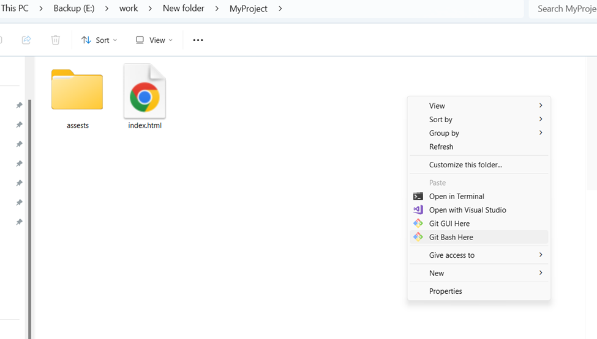
  **Bước 5**: Khởi tạo một repository Git mới trong thư mục hiện tại bằng cách chạy câu lệnh:

  ```bash
  git init
  ```

  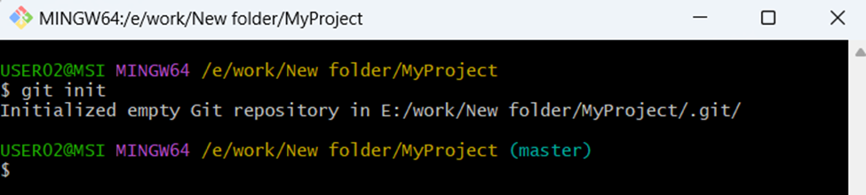

**Bước 6**: Liên kết một repository Git cục bộ với một repository từ xa (remote repository)

- Chạy lệnh sau để thêm remote repository:
  ```bash
  git remote add origin <SSH_link>
  ```
- chạy `git remote  –v` để kiểm tra bước 5 đã thành công chưa.

  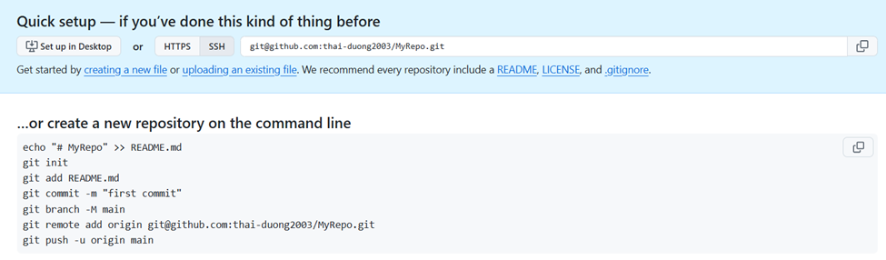
  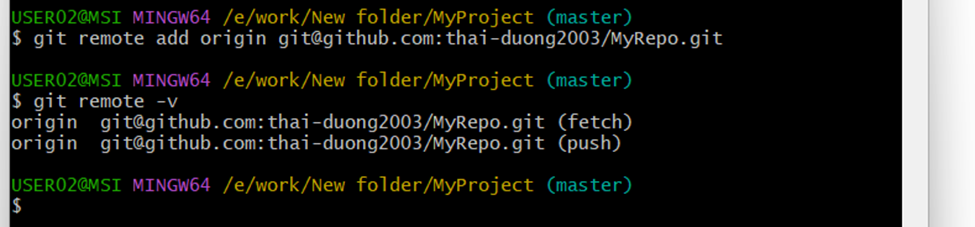

**Bước 7**: Thêm tất cả các tệp và thư mục đã thay đổi trong thư mục hiện tại

```bash
 git add .
```

**Bước 8**: Tạo một commit mới trong Git

```bash
git commit -m"tên commit"
```

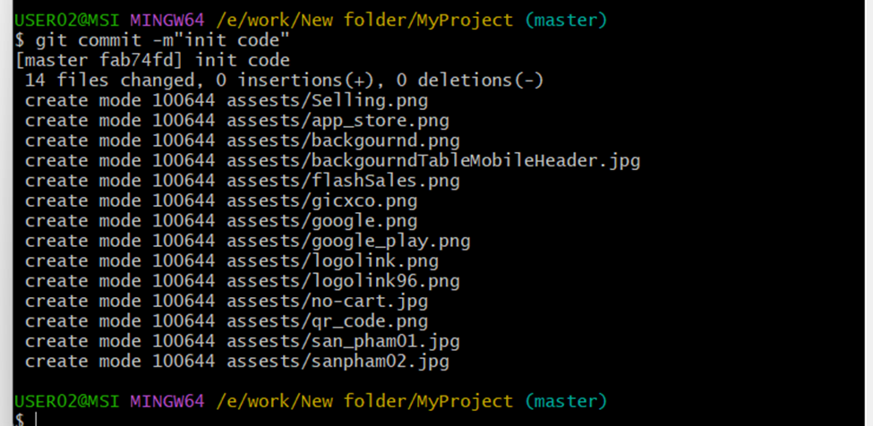

**Bước 9**: Đẩy (push) các thay đổi từ branch master trong repository cục bộ lên branch master trên repository từ xa (remote)

```bash
git push origin tên_nhánh
```

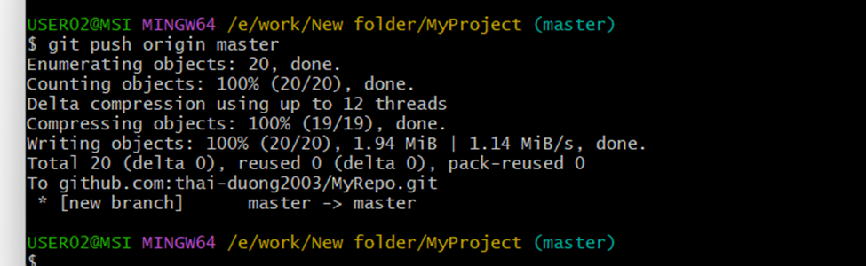

Như vậy chúng ta đã hoàn thành việc tạo vào đẩy file lên repo github
refesh lại trang để xem kết quả

### 5. Nhánh (Branch)

- Nhánh (branch) là một phiên bản riêng biệt của mã nguồn, giúp bạn phát triển và thử nghiệm các tính năng hoặc sửa lỗi mà không ảnh hưởng đến mã nguồn chính. Nhánh phổ biến nhất trong mỗi repository là nhánh chính ( main hoặc master), nơi lưu trữ phiên bản ổn định của dự án. Khi bạn tạo một nhánh mới, bạn sẽ có một bản sao của mã nguồn ở thời điểm hiện tại, và các thay đổi trên nhánh này sẽ không ảnh hưởng đến nhánh khác cho đến khi bạn "hợp nhất" (merge) chúng.

#### Tạo nhánh:

**- Mở cửa sổ Terminal và di chuyển đến thư mục**

- Chạy lệnh `git checkout -b tên_nhánh` để tạo 1 nhánh mới
- Chạy `git branch` để xem tất cả nhánh
- `git push -u origin tên_nhánh` để đưa nhánh lên remote
- `git checkout tên_nhánh` để di chuyển giữa các nhánh

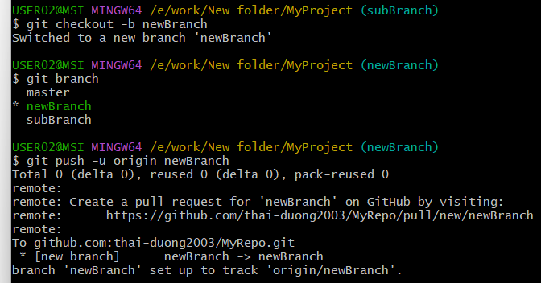

### 6. Gộp nhánh (merge coder)

- gộp nhánh (hay còn gọi là merge) là quá trình kết hợp các thay đổi từ một nhánh này vào nhánh khác. Thao tác này thường được sử dụng khi bạn muốn tích hợp những thay đổi từ một nhánh phụ (feature branch) vào nhánh chính (main hoặc master), để những thay đổi từ nhánh phụ có thể được đưa vào dự án chính thức.

**Có hai kiểu gộp nhánh chính trong Git:**

- **Merge không có xung đột (Fast-forward merge)**
  Đây là trường hợp khi nhánh đích chưa có thêm bất kỳ thay đổi nào kể từ khi tạo ra nhánh phụ.
  Lệnh: `git merge <tên_nhánh>`
- **Merge có xung đột (Three-way merge)**
  Xảy ra khi cả hai nhánh đều có thay đổi từ điểm chung cuối cùng (tức là cả nhánh chính và nhánh phụ đều có commit mới).
  Git sẽ tạo ra một commit gộp mới để kết hợp các thay đổi từ cả hai nhánh.

**Quy trình gộp nhánh (Merge)**
Chuyển đến nhánh mà bạn muốn gộp vào (thường là nhánh chính):

```bash
git checkout main
```

Sau đó thực hiện lệnh gộp:

```bash
git merge <ten_nhanh_phu>
```

Nếu có xung đột, bạn cần mở các file có xung đột, giải quyết chúng, sau đó lưu lại và hoàn tất quá trình bằng lệnh:

```bash
git add <file_có_xung_đột>
git commit
```

### 7. Đẩy lên github sau khi làm việc

- Mở Terminal và di chuyển vào thư mục dự án
- Chạy `git add .` để thêm toàn bộ file đã thay đổi
- Chạy `git commit -m"tên_commit"` để tạo 1 commit mới
- Chạy `git push origin tên_nhánh` để Push lên remote
  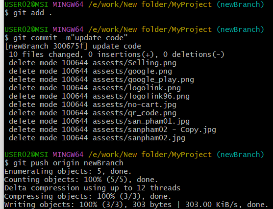
